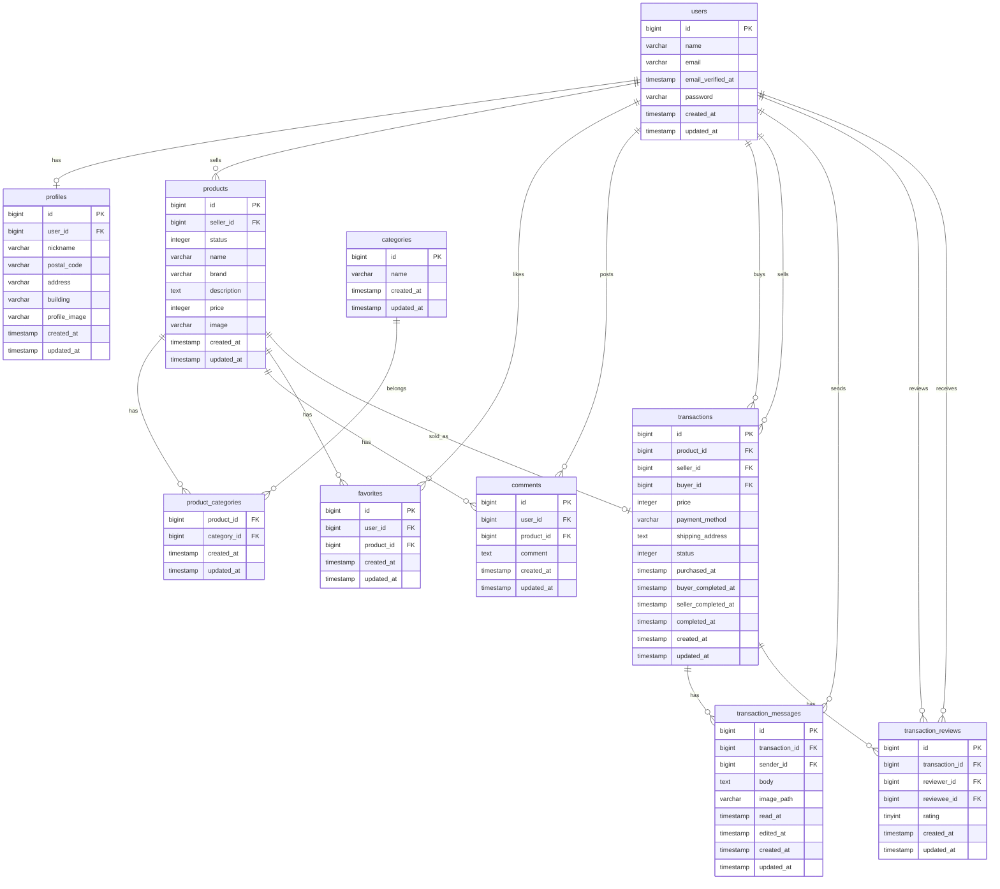

# COACHTECH フリマ（Laravel）

フリマアプリの学習用プロジェクトです。  
会員登録・ログイン（メール認証あり）を前提に、商品出品・購入、いいね、コメント、マイリスト、プロフィール編集などの一連の機能を実装しています。  
PHPUnit を用いて要件ベースのテストを作成し、バリデーション・画面表示・DB反映まで確認できる状態にしています。

---

## Docker ビルド
git clone git@github.com:taira11/flea-market

cd flea-market/online-marketplace

docker-compose up -d --build

## Laravel 環境構築
docker-compose exec php bash

composer install

cp .env.example .env

php artisan key:generate

.env以下修正
```env
DB_CONNECTION=mysql
DB_HOST=mysql
DB_PORT=3306
DB_DATABASE=laravel_db
DB_USERNAME=laravel_user
DB_PASSWORD=laravel_pass
```

php artisan migrate

## ダミーデータについて
商品データ / カテゴリ / ユーザー情報は Seeder により作成

商品画像は ダウンロード済み素材を storage に保存 して使用

php artisan migrate:fresh --seed

## 画像アップロードについて
本課題では、採点時に画面表示を正しく確認できるよう  
`storage/app/public` 配下にサンプル画像を含めています。

プロフィール画像 storage/app/public/products/profiles に保存

商品画像は torage/app/public/products/products に保存

php artisan storage:link により

/public/storage から参照可能

初回セットアップ時は、以下のコマンドを実行してください。

php artisan storage:link

## メール送信（Mailtrap）

本アプリでは、会員登録時のメール認証に Mailtrap を使用しています。

開発環境でメール送信を確認するため、以下の手順で Mailtrap の設定を行ってください。

### Mailtrap 設定手順

1. https://mailtrap.io にアクセスしてアカウントを作成
2. Sandbox を作成
3. Code SamplesにてLaravelのバージョンを設定し SMTP 設定を確認
4. `.env` に以下を設定

```env
MAIL_MAILER=smtp
MAIL_HOST=smtp.mailtrap.io
MAIL_PORT=2525
MAIL_USERNAME=xxxxxxxx
MAIL_PASSWORD=xxxxxxxx
MAIL_ENCRYPTION=tls
MAIL_FROM_ADDRESS=no-reply@example.com
MAIL_FROM_NAME="COACHTECH フリマ"
```

## 開発環境 URL
アプリトップ:http://localhost

会員登録:http://localhost/register

ログイン:http://localhost/login

phpMyAdmin:http://localhost:8080

## 使用技術（実行環境）
PHP 8.1.33

Laravel 8.83.29

MySQL 8.0.26

nginx 1.21.1

Docker / Docker Compose

jQuery 3.7.1

Stripe（テストモード）

## 主な機能一覧
---
## 認証機能
会員登録

ログイン / ログアウト

メール認証（再送信対応）

## プロフィール
プロフィール画像登録（storage 使用）

ユーザー名 / 住所変更

出品商品一覧 / 購入商品一覧表示

## 商品機能
商品一覧表示
　
商品詳細表示

商品検索（部分一致）

カテゴリ複数選択

商品出品（画像アップロード対応）

購入機能（Stripe Checkout）

## いいね/コメント
商品へのいいね追加 / 解除

マイリスト表示

コメント投稿（認証必須）

## テスト
PHPUnit を使用してテストを実装しています。

php artisan test

## テスト内容（一部）
会員登録バリデーション

ログイン処理

商品一覧取得

いいね機能

コメント投稿

商品購入処理

## Stripe 決済について
Stripe Checkout（テストモード）を使用

最低決済金額の制約により、商品価格は120円以上に設定しています

stripeを登録した後,APIキーを確認し.envに以下の内容を設定

STRIPE_KEY=pk_test_xxxxx

STRIPE_SECRET=sk_test_xxxxx

## カード決済を行う場合は、以下のテストカードをご利用ください。
カード番号：4242 4242 4242 4242

有効期限：未来の日付

CVC：任意の3桁


---

## 追加実装：取引チャット機能

本アプリでは、商品購入後に購入者と出品者が取引チャットを行える機能を追加しています。

### 取引チャット機能

- マイページから取引中の商品を確認できます
- 取引中の商品をクリックすると、取引チャット画面へ遷移します
- 取引チャット画面では、購入者と出品者がメッセージを投稿できます
- メッセージには画像を添付できます
- 投稿済みメッセージは編集・削除できます
- 未読メッセージがある場合、マイページの「取引中の商品」タブと商品カードに通知バッジが表示されます

### メッセージ投稿バリデーション

取引チャットのメッセージ投稿では、以下のバリデーションを行っています。

| 項目 | 条件 | エラーメッセージ |
|---|---|---|
| 本文 | 必須 | 本文を入力してください |
| 本文 | 400文字以内 | 本文は400文字以内で入力してください |
| 画像 | jpeg / png のみ | 「.png」または「.jpeg」形式でアップロードしてください |

### 取引評価機能

- 購入者は取引チャット画面から取引完了を行えます
- 取引完了時に、購入者は出品者を5段階で評価できます
- 購入者の評価完了後、出品者側の取引画面に評価モーダルが表示されます
- 出品者も購入者を5段階で評価できます
- 双方の評価が完了すると、取引は完了状態になります
- マイページには、自分が受け取った評価の平均が星で表示されます

### 取引完了メール

購入者が取引完了を行うと、出品者宛に取引完了通知メールが送信されます。

メール件名：

```txt
取引完了のお知らせ
```

メール本文には、以下の情報が含まれます。

- 出品者名
- 商品名
- 購入者名
- 取引画面で評価を行う案内

---

## 追加テーブル

取引チャット機能のため、以下のテーブルを追加しています。

### transaction_messages テーブル

| カラム名 | 内容 |
|---|---|
| id | 主キー |
| transaction_id | 取引ID |
| sender_id | 送信者ID |
| body | メッセージ本文 |
| image_path | 添付画像パス |
| read_at | 既読日時 |
| edited_at | 編集日時 |
| created_at | 作成日時 |
| updated_at | 更新日時 |

### transaction_reviews テーブル

| カラム名 | 内容 |
|---|---|
| id | 主キー |
| transaction_id | 取引ID |
| reviewer_id | 評価者ID |
| reviewee_id | 評価対象者ID |
| rating | 評価値 |
| created_at | 作成日時 |
| updated_at | 更新日時 |

### transactions テーブル追加カラム

| カラム名 | 内容 |
|---|---|
| buyer_completed_at | 購入者が取引完了した日時 |
| seller_completed_at | 出品者が評価完了した日時 |

---

## ダミーデータ

本アプリでは、以下のダミーユーザーを作成しています。

| ユーザー種別 | メールアドレス | パスワード | 備考 |
|---|---|---|---|
| 出品ユーザー1 | seller1@example.com | password | C001〜C005の商品を出品 |
| 出品ユーザー2 | seller2@example.com | password | C006〜C010の商品を出品 |
| 一般ユーザー | user@example.com | password | 商品未出品ユーザー |

### 商品データ

| 商品ID | 商品名 | 価格 | コンディション |
|---|---|---:|---|
| C001 | 腕時計 | 15,000 | 良好 |
| C002 | HDD | 5,000 | 目立った傷や汚れなし |
| C003 | 玉ねぎ3束 | 300 | やや傷や汚れあり |
| C004 | 革靴 | 4,000 | 状態が悪い |
| C005 | ノートPC | 45,000 | 良好 |
| C006 | マイク | 8,000 | 目立った傷や汚れなし |
| C007 | ショルダーバッグ | 3,500 | やや傷や汚れあり |
| C008 | タンブラー | 500 | 状態が悪い |
| C009 | コーヒーミル | 4,000 | 良好 |
| C010 | メイクセット | 2,500 | 目立った傷や汚れなし |

---

## 追加機能の確認手順

### 1. ダミーデータ作成

```bash
php artisan migrate:fresh --seed
```

### 2. 一般ユーザーでログイン

```txt
メールアドレス：user@example.com
パスワード：password
```

### 3. 商品を購入

商品詳細画面から購入手続きへ進み、購入を完了します。

購入完了後、取引チャット画面へ遷移します。

### 4. 取引チャット確認

取引チャット画面では、以下を確認できます。

- メッセージ投稿
- 画像投稿
- 投稿済みメッセージの編集
- 投稿済みメッセージの削除
- 取引完了ボタン
- 評価モーダル

### 5. 出品者側の確認

出品者ユーザーでログインし、マイページの「取引中の商品」から対象取引を開きます。

購入者が取引完了済みの場合、評価モーダルが表示されます。

---

## メール設定

取引完了通知メールの送信確認には Mailtrap を使用できます。

`.env` に以下を設定してください。

```env
MAIL_MAILER=smtp
MAIL_HOST=smtp.mailtrap.io
MAIL_PORT=2525
MAIL_USERNAME=xxxxxxxx
MAIL_PASSWORD=xxxxxxxx
MAIL_ENCRYPTION=tls
MAIL_FROM_ADDRESS=no-reply@example.com
MAIL_FROM_NAME="COACHTECH フリマ"
```

`.env` を変更した場合は、以下のコマンドを実行してください。

```bash
php artisan config:clear
php artisan cache:clear
```
---

## ER図

